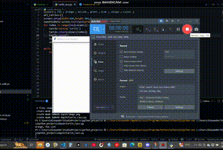
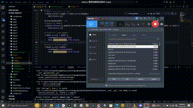

# Hi there

i am emmanuel a pythoneer/Flutter Developer  
this is my python journey  
from  

## Day 19 to Day 100

### 100 days of Code(python): Appbrewery

## Rules

All sections have a note.md file containing all i have learnt.
Out of these are prominent projects i built 
# day19
 using turtle library to control screen  

Screen().setup sets the screen width and height

# day22

[Watch video](https://github.com/xanderelsmith/Python/raw/refs/heads/main/day22/day22.mp4)