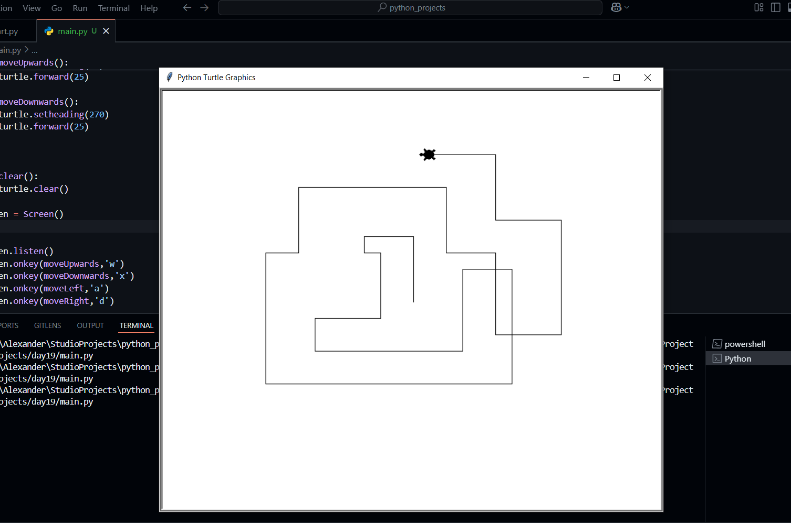

# Hi there

i am emmanuel a pythoneer/Flutter Developer  
this is my python journey 
from  

## Day 19 to Day 100

### 100 days of Code(python): Appbrewery

## Rules

All sections have a note.md file containing all i have learnt.
Out of these are prominent projects i built 
1. using turtle library to control screen

# day19

Screen().setup sets the screen width and height

# day22

<video width="320" height="240" controls loop="" muted="" autoplay="">
  <source src="https://github.com/xanderelsmith/Python/raw/refs/heads/main/day22/day22.mp4">
</video>